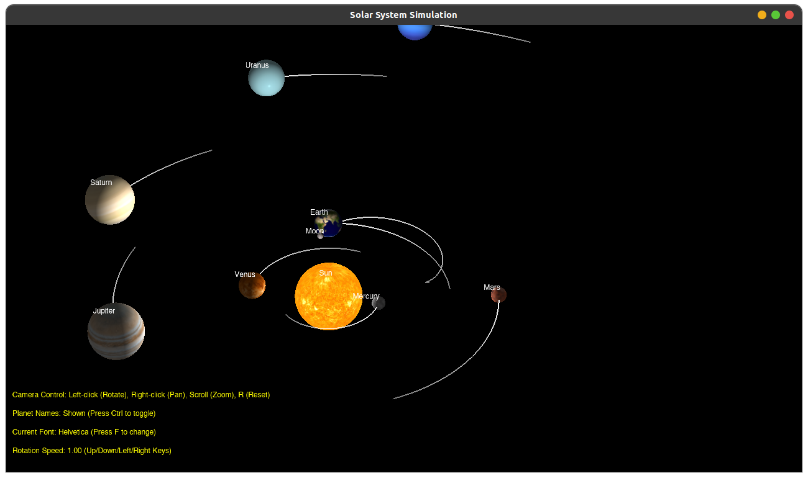

# 太阳系模拟器



这是一个使用OpenGL实现的太阳系模拟器，包含太阳系的九大行星以及月球。

## 编译与运行

确保您已安装以下依赖项：
- OpenGL
- GLEW
- GLFW
- GLM
- FreeType

使用CMake编译项目：

```bash
mkdir build
cd build
cmake ..
make
```

运行程序：

```bash
./solar_system
```

## 操作说明

### 相机控制
- **鼠标左键拖动**：旋转视角
- **鼠标右键拖动**：平移视角
- **鼠标滚轮**：缩放视角（放大/缩小）
- **R键**：重置相机视角到默认位置

### 行星运动控制
- **上方向键**：增加行星自转和公转速度
- **下方向键**：减少行星自转和公转速度
- **右方向键**：倍增行星运动速度 (×1.2)
- **左方向键**：减缓行星运动速度 (×0.8)

### 界面控制
- **Ctrl键**：显示/隐藏行星名称
- **F键**：切换显示字体
- **Esc键**：退出程序